# Go-Kart Telemetry Analysis

Turns raw Alfano6 go-kart lap-logger CSVs into cleaned per-lap data, an
automatically-detected corner map, per-corner metrics, consistency/loss
analysis, and auto-generated improvement recommendations — with three ways
to view it all: static PNG plots, a Streamlit dashboard, and a single
self-contained HTML dashboard.

🔗 **[View a sample dashboard](https://aaryan-engineering.github.io/go-kart-telemetry-analysis/)**

*This is the HTML dashboard view. The data, graphs, recommendations and conclusions
are all generated from a real go-kart telemetry session, not mock data. This link
shows what gets produced automatically when you run the pipeline on your own session.
Plotly-based, no install needed, includes the full engineering conclusions write-up
at the bottom of the page.*

## Screenshots

**Driver summary — best lap, theoretical best, peak G, corner-by-corner loss**
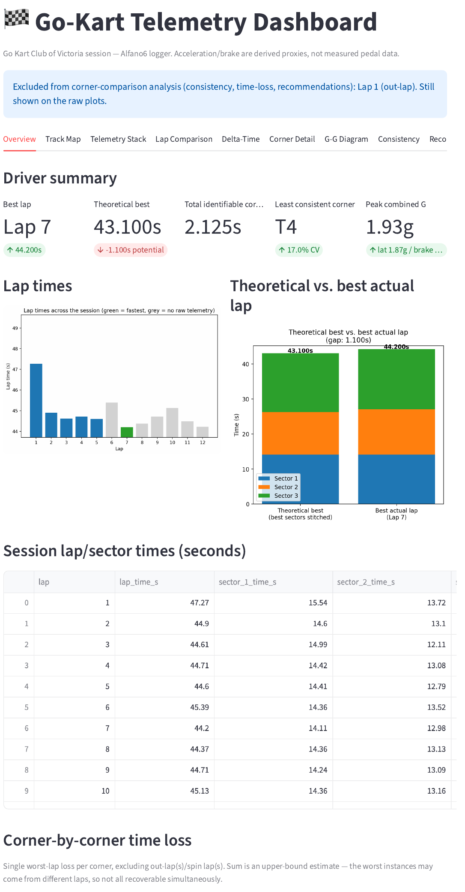

**Track map with automatically detected corners**
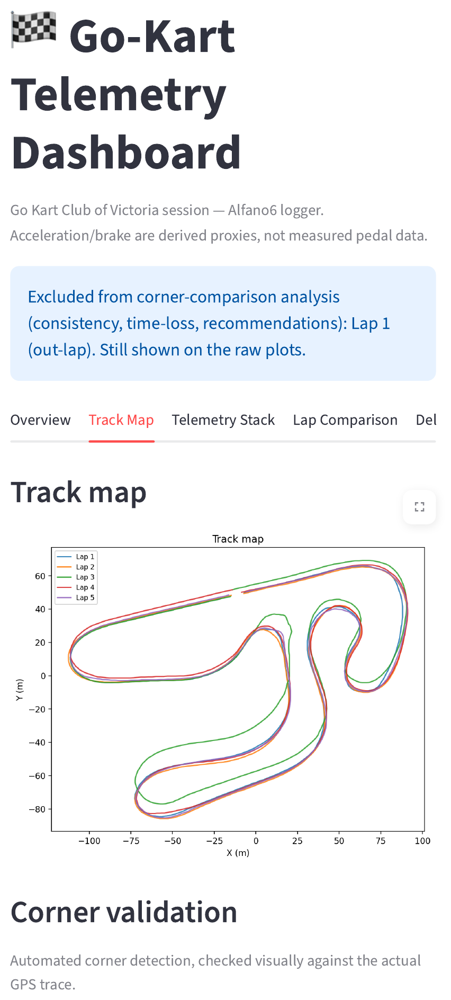
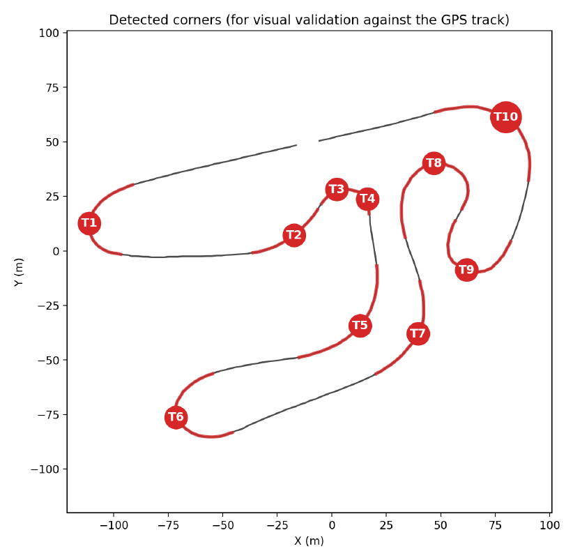

**Telemetry stack — speed, RPM, accel-proxy, brake-proxy**
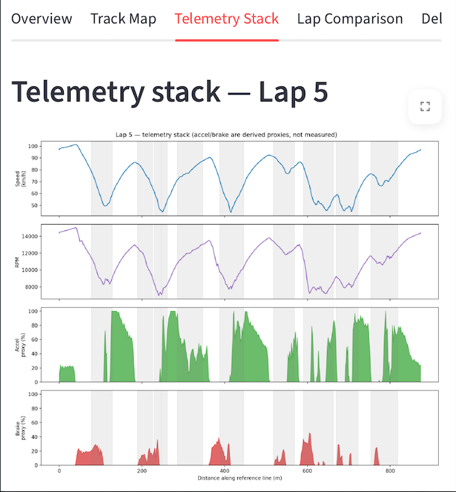

**Lap comparison and delta-time vs. a reference lap**
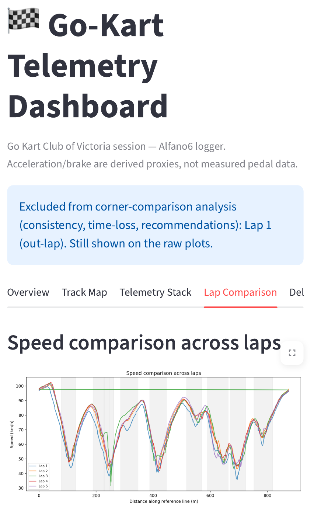
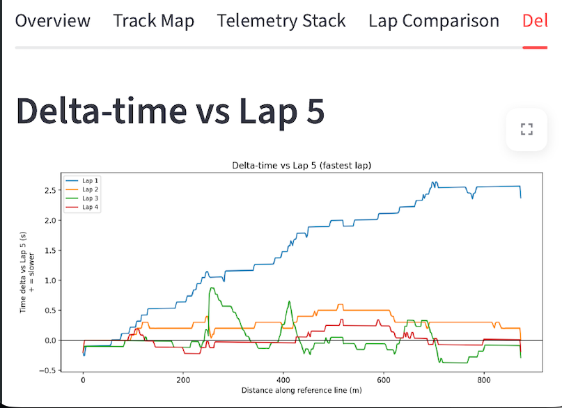

**Per-corner speed trace**
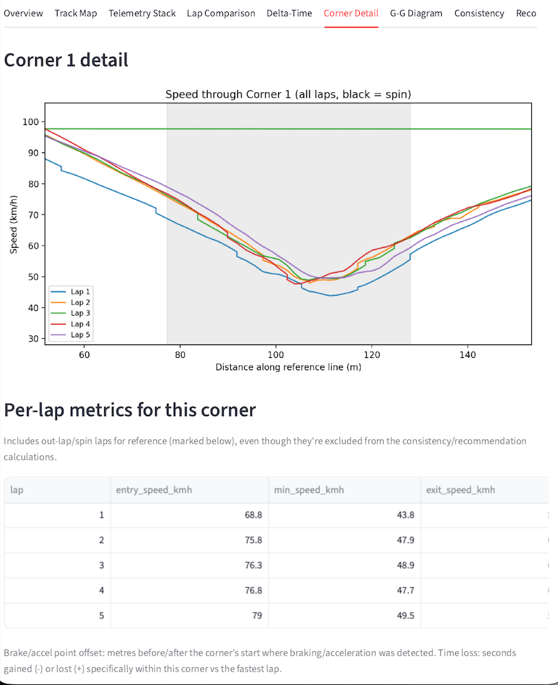

**G-G diagram — grip envelope usage**
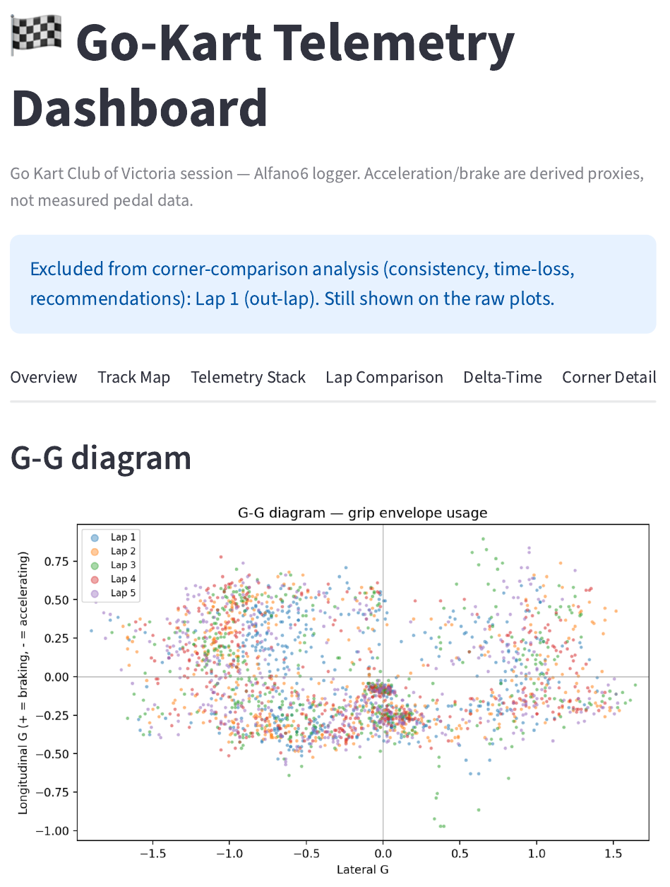

**Corner consistency ranking and time-loss table**
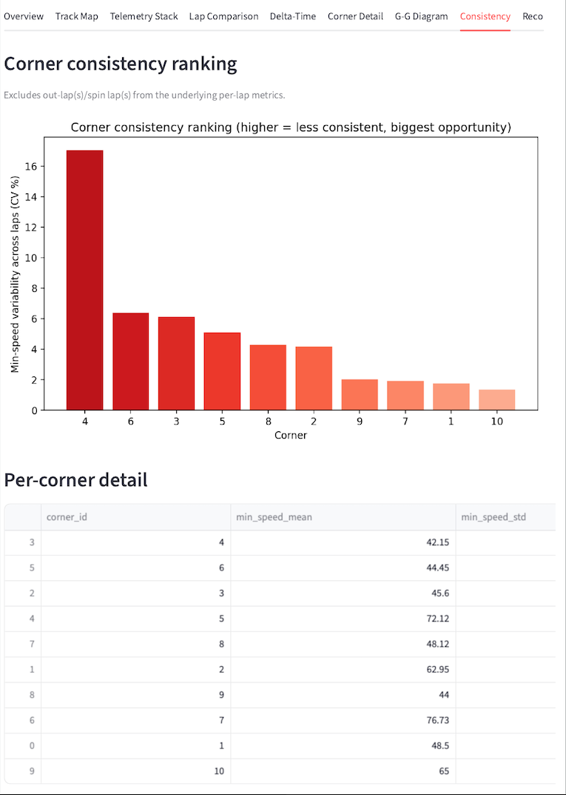
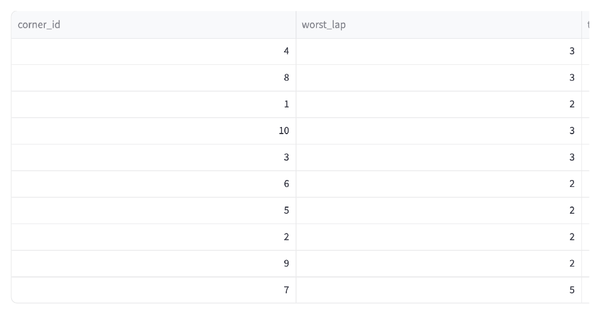

**Auto-generated improvement recommendations**
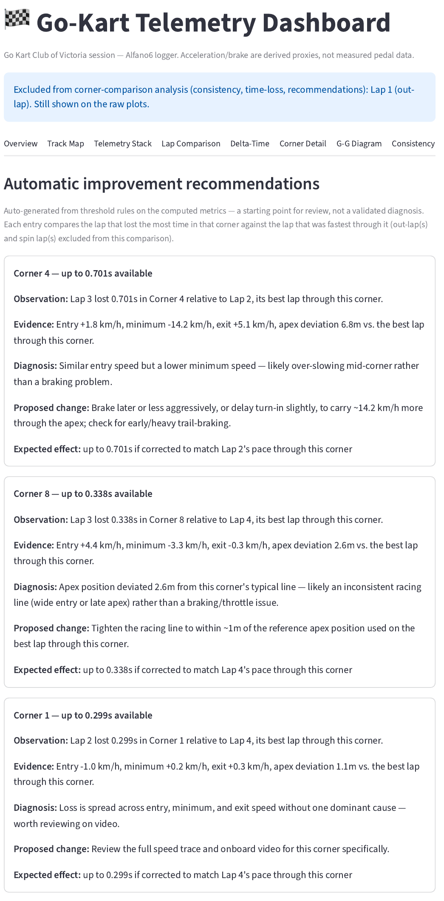
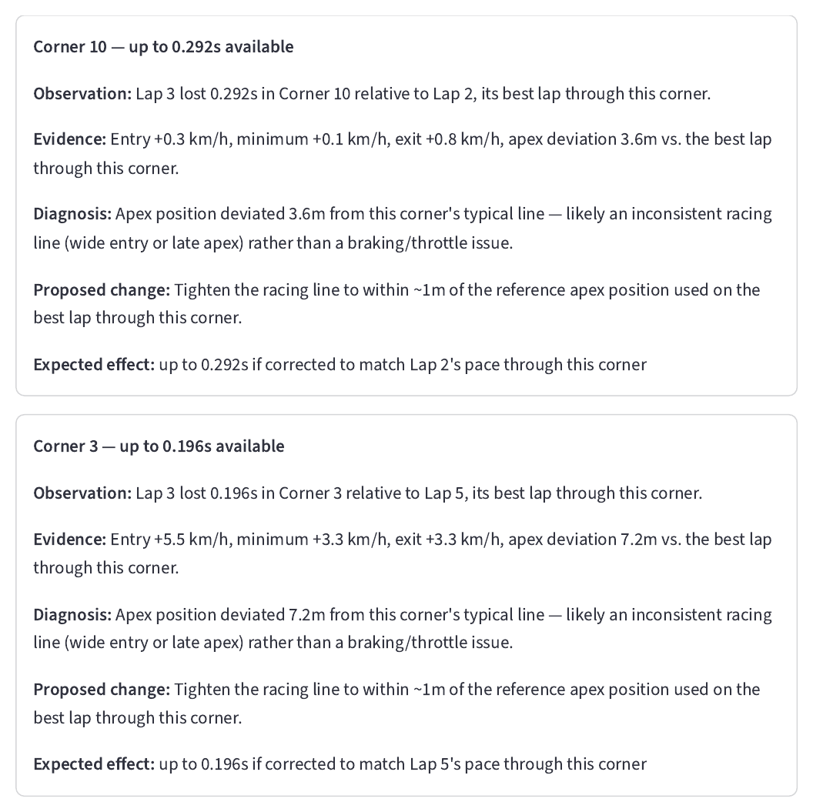

## What's here

```
data/
  raw_sample/       <- put your lap*.csv + summary.csv here (not committed)
  processed/        <- cleaned CSVs, written by the pipeline
outputs/            <- PNGs, markdown reports (incl. 09_engineering_conclusions.md), dashboard.html
src/
  loader.py         <- ingest + clean raw CSVs, GPS glitch filtering, reference-line alignment
  derive.py         <- calibrated G-force / accel-proxy / brake-proxy channels
  spins.py          <- spin detection (yaw-rate vs measured grip)
  corners.py        <- automatic corner detection + per-lap corner metrics
  analysis.py       <- consistency, time-loss, recommendation engine, lap exclusion logic
  plots.py          <- matplotlib plots (used by main.py and dashboard/app.py)
  main.py           <- runs the full pipeline, writes everything to outputs/
dashboard/
  app.py            <- Streamlit dashboard (`streamlit run dashboard/app.py`)
  build_dashboard.py<- builds a single offline outputs/dashboard.html (Plotly), embeds the
                       engineering conclusions automatically
docs/
  index.html        <- published copy of outputs/dashboard.html, served by GitHub Pages
  screenshots/       <- PNGs used in this README
requirements.txt
```

## Setup

```bash
python -m venv .venv
source .venv/bin/activate        # Windows: .venv\Scripts\activate
pip install -r requirements.txt
```

Drop your session's `lap1.csv`, `lap2.csv`, ... and `summary.csv` into
`data/raw_sample/`.

## Run it

```bash
# Full pipeline: cleaned data + every static plot + markdown reports
# (also generates outputs/09_engineering_conclusions.md)
python src/main.py

# Interactive dashboard (needs streamlit) — run from the project root
streamlit run dashboard/app.py

# Single offline HTML file, shareable with no install needed to view it —
# automatically pulls in outputs/09_engineering_conclusions.md if it exists
python dashboard/build_dashboard.py
```

### Publishing the HTML dashboard (GitHub Pages)

The offline HTML dashboard can be published as a live site instead of just
sitting in `outputs/`:

```bash
python src/main.py
python dashboard/build_dashboard.py
cp outputs/dashboard.html docs/index.html
git add docs/index.html
git commit -m "Update published dashboard"
git push
```

`docs/index.html` is a **published copy**, not a source file — always
regenerate it from `outputs/dashboard.html` via the steps above rather than
editing it directly, or your changes will be overwritten next time it's
copied over. GitHub Pages (Settings → Pages → Deploy from branch → `/docs`)
then serves it automatically at `https://<username>.github.io/<repo>/`.

## Out-laps and spins are excluded from corner comparisons

Two kinds of lap will distort "which lap was best/worst through this
corner" if left in the comparison pool, so they're automatically excluded
from the consistency ranking, corner time-loss table, and the
recommendation engine — but they're **still drawn** on every raw plot
(track map, speed comparison, delta-time, G-G diagram, telemetry stack) so
you don't lose visibility of them:

- **The out-lap.** The first lap of a session is conventionally a cold-tyre
  warm-up lap, not a real attempt — comparing corner technique against it
  is meaningless. This is `OUT_LAPS = (1,)` near the top of `src/main.py`,
  `dashboard/app.py`, and `dashboard/build_dashboard.py`; change it if a
  given session's out-lap isn't lap 1 (or there isn't one).
- **Any lap with a detected spin.** See `src/spins.py`: a spin is flagged
  when yaw rate is high *and* measured grip (combined G) is low for a
  sustained window — the signature of the kart rotating on its own
  momentum after the tyres let go, as opposed to a normal hard corner
  where high yaw rate comes *with* high measured G. A lap like this can
  still be the fastest through a corner's entry, or even set a good sector
  time, while being dragged down badly by the spin elsewhere — so it's
  colour-coded **black** on every plot instead of being silently mixed in
  with normal laps. Thresholds live in `detect_spin_laps(...)` in
  `spins.py` if you need to tune them for a different logger/kart.

Every place this exclusion happens says so — check the generated
`outputs/09_engineering_conclusions.md` ("Laps excluded from
corner-comparison analysis" section), the info banner at the top of the
Streamlit app, or the "Laps Excluded From Corner-Comparison Analysis"
section of the HTML dashboard for exactly which laps were excluded and
why, on a given run.

## Notes

- Acceleration/brake channels are derived proxies (RPM slope; calibrated
  longitudinal G), not measured pedal data — this dataset has no pedal
  sensors, which is normal for a kart logger. See `derive.py`.
- Corner detection is automatic from track curvature; spot-check
  `outputs/01b_track_map_corners_validated.png` against the real track
  shape when using this on a new circuit.
- Recommendations are threshold-based heuristics on entry/apex/exit speed,
  not a validated diagnostic model — a starting point for review, not a
  final verdict.
